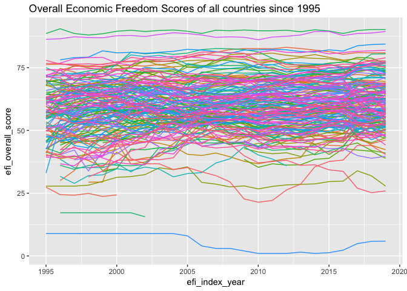
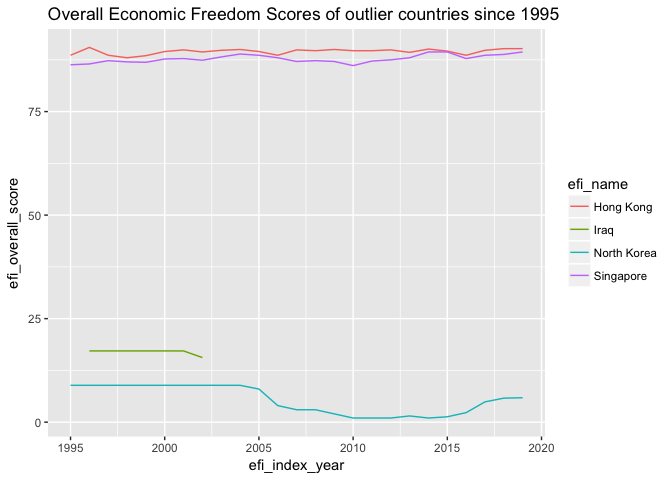

Economic Cleaning
================

initial work
------------

This project is an excercise in data cleaning and data exploration. This project will investigate some economic data.

This project was inspired by an economic freedom index dataset I found on Kaggle Datasets. <https://www.kaggle.com/lewisduncan93/the-economic-freedom-index/version/1#>

I quite like freedom and it would be interesting, and nice, to identify the relationships between these economic freedom indicators and other important things like economic performance, human well being, corruption, politics, wars, natural disasters, etc. The first thing we should do is read the dataset and inspect it.

``` r
df <- read_csv("economic_freedom_index2019_data.csv")
```

    ## Parsed with column specification:
    ## cols(
    ##   .default = col_character(),
    ##   CountryID = col_integer()
    ## )

    ## See spec(...) for full column specifications.

``` r
df
```

    ## # A tibble: 186 x 34
    ##    CountryID `Country Name` WEBNAME Region `World Rank` `Region Rank`
    ##        <int> <chr>          <chr>   <chr>  <chr>        <chr>        
    ##  1         1 Afghanistan    Afghan… Asia-… 152          39           
    ##  2         2 Albania        Albania Europe 52           27           
    ##  3         3 Algeria        Algeria Middl… 171          14           
    ##  4         4 Angola         Angola  Sub-S… 156          33           
    ##  5         5 Argentina      Argent… Ameri… 148          26           
    ##  6         6 Armenia        Armenia Europe 47           24           
    ##  7         7 Australia      Austra… Asia-… 5            4            
    ##  8         8 Austria        Austria Europe 31           16           
    ##  9         9 Azerbaijan     Azerba… Asia-… 60           13           
    ## 10        10 Bahamas        Bahamas Ameri… 76           15           
    ## # ... with 176 more rows, and 28 more variables: `2019 Score` <chr>,
    ## #   `Property Rights` <chr>, `Judical Effectiveness` <chr>, `Government
    ## #   Integrity` <chr>, `Tax Burden` <chr>, `Gov't Spending` <chr>, `Fiscal
    ## #   Health` <chr>, `Business Freedom` <chr>, `Labor Freedom` <chr>,
    ## #   `Monetary Freedom` <chr>, `Trade Freedom` <chr>, `Investment
    ## #   Freedom` <chr>, `Financial Freedom` <chr>, `Tariff Rate (%)` <chr>,
    ## #   `Income Tax Rate (%)` <chr>, `Corporate Tax Rate (%)` <chr>, `Tax
    ## #   Burden % of GDP` <chr>, `Gov't Expenditure % of GDP` <chr>,
    ## #   Country <chr>, `Population (Millions)` <chr>, `GDP (Billions,
    ## #   PPP)` <chr>, `GDP Growth Rate (%)` <chr>, `5 Year GDP Growth Rate
    ## #   (%)` <chr>, `GDP per Capita (PPP)` <chr>, `Unemployment (%)` <chr>,
    ## #   `Inflation (%)` <chr>, `FDI Inflow (Millions)` <chr>, `Public Debt (%
    ## #   of GDP)` <chr>

This does seem interesting, we have quite a few columns, with one row for each country. Many of these columns have been read in incorrectly. However, this dataset only contained data for 2019. I looked at the source website and it appears that the data is only available year by year <https://www.heritage.org/> This is not a problem, I can simply download the files for each year and then merge them together.

``` r
name_list <- list.files("economic_freedom/")

extract_economic_freedom_year <- function(file){
  #take a file name in the economic_freedom folder
  #read the csv into memory
  #make sure all columns except for name are treated as numeric
  read_csv(paste0("economic_freedom/",file),
           na="N/A") %>% 
  mutate_at(vars(-name),as.numeric)
}

data_list <- name_list %>% map(extract_economic_freedom_year)
```

    ## Warning: package 'bindrcpp' was built under R version 3.4.4

``` r
economic_freedom <- data_list %>% bind_rows()
#spaces in column names causes trouble so we will replace these with underscores
#we will be joining this data set with other datasets so it makes sense to 
#add a label indicating the source dataset here.
names(economic_freedom) <- str_c("efi_",names(economic_freedom) %>% str_replace(" ","_"))
economic_freedom
```

    ## # A tibble: 4,598 x 15
    ##    efi_name efi_index_year efi_overall_sco… efi_property_ri…
    ##    <chr>             <dbl>            <dbl>            <dbl>
    ##  1 Afghani…           1995             NA                 NA
    ##  2 Albania            1995             49.7               50
    ##  3 Algeria            1995             55.7               50
    ##  4 Angola             1995             27.4               30
    ##  5 Argenti…           1995             68                 70
    ##  6 Armenia            1995             NA                 NA
    ##  7 Austral…           1995             74.1               90
    ##  8 Austria            1995             70                 90
    ##  9 Azerbai…           1995             NA                 NA
    ## 10 Bahrain            1995             76.2               60
    ## # ... with 4,588 more rows, and 11 more variables:
    ## #   efi_government_integrity <dbl>, efi_judicial_effectiveness <dbl>,
    ## #   efi_tax_burden <dbl>, efi_government_spending <dbl>,
    ## #   efi_fiscal_health <dbl>, efi_business_freedom <dbl>,
    ## #   efi_labor_freedom <dbl>, efi_monetary_freedom <dbl>,
    ## #   efi_trade_freedom <dbl>, efi_investment_freedom <dbl>,
    ## #   efi_financial_freedom <dbl>

We now have a reasonable dataset and can perform some initial plots. The most basic plot we can make is a line plot of our time series.

``` r
economic_freedom %>% 
  ggplot(aes(x=efi_index_year,y=efi_overall_score,color=efi_name)) + 
  geom_line() +
  theme(legend.position = "none") +
  ggtitle("Overall Economic Freedom Scores of all countries since 1995")
```

    ## Warning: Removed 421 rows containing missing values (geom_path).



This plot is quite crowded and we have had to leave off the key indicating which colors are which. There are a few interesting points we can gather from this: \* some countries start with high freedom and maintain steady high freedom \* some countries start with low freedom and maintain steady low freedom \* some countries do not have data spanning the full range. We can easily filter out a few of these countries and identify them. These outliers may be interesting.

``` r
economic_freedom %>% 
  filter(efi_overall_score > 85 | efi_overall_score < 20) %>% 
  ggplot(aes(x=efi_index_year,y=efi_overall_score,color=efi_name)) + 
  geom_line() +
  ggtitle("Overall Economic Freedom Scores of outlier countries since 1995")
```



That simple filter was very helpful. We see that Singapore and Hong Kong have had long term high economic freedom, and that North Korea has had long term low economic freedom. It is commonly known that Singapore and Hong Kong are quite wealthy, while North Korea is not as wealthy but these are outliers and only a few data points. We also see that data about Iraq ceases to be available after 2002, this makes sense as the US and its allies invaded Iraq in 2003.

``` r
economic_freedom %>% 
  filter(efi_name=="Iraq") %>% 
  select(efi_overall_score) %>% 
  summary()
```

    ##  efi_overall_score
    ##  Min.   :15.60    
    ##  1st Qu.:17.20    
    ##  Median :17.20    
    ##  Mean   :16.97    
    ##  3rd Qu.:17.20    
    ##  Max.   :17.20    
    ##  NA's   :18

There are some interesting questions we can ask: linear model to identify general trends calculate variance to see increases and decreases how does this measure correlate with important things like wealth and health
