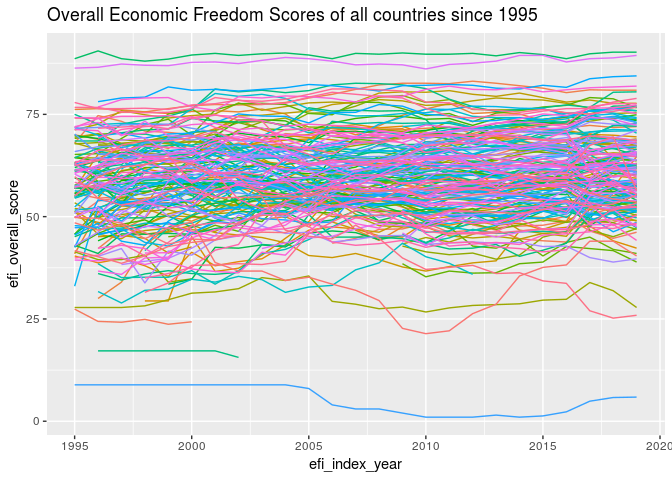
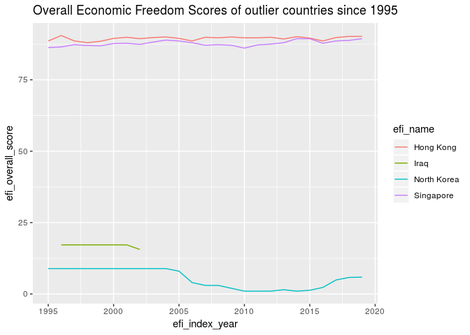

Economic Cleaning
================

-   [initial work](#initial-work)
-   [Dataset \#2 - World bank data](#dataset-2---world-bank-data)

initial work
------------

This project is an excercise in data cleaning and data exploration. This project will investigate some economic data.

This project was inspired by an economic freedom index dataset I found on Kaggle Datasets. <https://www.kaggle.com/lewisduncan93/the-economic-freedom-index/version/1#>

I quite like freedom and it would be interesting, and nice, to identify the relationships between these economic freedom indicators and other important things like economic performance, human well being, corruption, politics, wars, natural disasters, environmental impact etc.

NB - for this study we are going to assume that these metrics are in some way true measures of economic freedom. The first thing we should do is read the dataset and inspect it.

``` r
df <- read_csv("economic_freedom_index2019_data.csv")
```

    ## Parsed with column specification:
    ## cols(
    ##   .default = col_character(),
    ##   CountryID = col_integer()
    ## )

    ## See spec(...) for full column specifications.

``` r
df
```

    ## # A tibble: 186 x 34
    ##    CountryID `Country Name` WEBNAME Region `World Rank` `Region Rank`
    ##        <int> <chr>          <chr>   <chr>  <chr>        <chr>        
    ##  1         1 Afghanistan    Afghan… Asia-… 152          39           
    ##  2         2 Albania        Albania Europe 52           27           
    ##  3         3 Algeria        Algeria Middl… 171          14           
    ##  4         4 Angola         Angola  Sub-S… 156          33           
    ##  5         5 Argentina      Argent… Ameri… 148          26           
    ##  6         6 Armenia        Armenia Europe 47           24           
    ##  7         7 Australia      Austra… Asia-… 5            4            
    ##  8         8 Austria        Austria Europe 31           16           
    ##  9         9 Azerbaijan     Azerba… Asia-… 60           13           
    ## 10        10 Bahamas        Bahamas Ameri… 76           15           
    ## # ... with 176 more rows, and 28 more variables: `2019 Score` <chr>,
    ## #   `Property Rights` <chr>, `Judical Effectiveness` <chr>, `Government
    ## #   Integrity` <chr>, `Tax Burden` <chr>, `Gov't Spending` <chr>, `Fiscal
    ## #   Health` <chr>, `Business Freedom` <chr>, `Labor Freedom` <chr>,
    ## #   `Monetary Freedom` <chr>, `Trade Freedom` <chr>, `Investment
    ## #   Freedom` <chr>, `Financial Freedom` <chr>, `Tariff Rate (%)` <chr>,
    ## #   `Income Tax Rate (%)` <chr>, `Corporate Tax Rate (%)` <chr>, `Tax
    ## #   Burden % of GDP` <chr>, `Gov't Expenditure % of GDP` <chr>,
    ## #   Country <chr>, `Population (Millions)` <chr>, `GDP (Billions,
    ## #   PPP)` <chr>, `GDP Growth Rate (%)` <chr>, `5 Year GDP Growth Rate
    ## #   (%)` <chr>, `GDP per Capita (PPP)` <chr>, `Unemployment (%)` <chr>,
    ## #   `Inflation (%)` <chr>, `FDI Inflow (Millions)` <chr>, `Public Debt (%
    ## #   of GDP)` <chr>

This does seem interesting, we have quite a few columns, with one row for each country. Many of these columns have been read in incorrectly. However, this dataset only contained data for 2019. I looked at the source website and it appears that the data is only available year by year <https://www.heritage.org/> This is not a problem, I can simply download the files for each year and then merge them together.

``` r
name_list <- list.files("economic_freedom/")

extract_economic_freedom_year <- function(file){
  #take a file name in the economic_freedom folder
  #read the csv into memory
  #make sure all columns except for name are treated as numeric
  read_csv(paste0("economic_freedom/",file),
           na="N/A") %>% 
  mutate_at(vars(-name),as.numeric)
}

data_list <- name_list %>% map(extract_economic_freedom_year)
```

    ## Warning: package 'bindrcpp' was built under R version 3.4.4

``` r
economic_freedom <- data_list %>% bind_rows()
#spaces in column names causes trouble so we will replace these with underscores
#we will be joining this data set with other datasets so it makes sense to 
#add a label indicating the source dataset here.
names(economic_freedom) <- str_c("efi_",names(economic_freedom) %>% str_replace(" ","_"))
economic_freedom
```

    ## # A tibble: 4,598 x 15
    ##    efi_name efi_index_year efi_overall_sco… efi_property_ri…
    ##    <chr>             <dbl>            <dbl>            <dbl>
    ##  1 Afghani…           1995             NA                 NA
    ##  2 Albania            1995             49.7               50
    ##  3 Algeria            1995             55.7               50
    ##  4 Angola             1995             27.4               30
    ##  5 Argenti…           1995             68                 70
    ##  6 Armenia            1995             NA                 NA
    ##  7 Austral…           1995             74.1               90
    ##  8 Austria            1995             70                 90
    ##  9 Azerbai…           1995             NA                 NA
    ## 10 Bahrain            1995             76.2               60
    ## # ... with 4,588 more rows, and 11 more variables:
    ## #   efi_government_integrity <dbl>, efi_judicial_effectiveness <dbl>,
    ## #   efi_tax_burden <dbl>, efi_government_spending <dbl>,
    ## #   efi_fiscal_health <dbl>, efi_business_freedom <dbl>,
    ## #   efi_labor_freedom <dbl>, efi_monetary_freedom <dbl>,
    ## #   efi_trade_freedom <dbl>, efi_investment_freedom <dbl>,
    ## #   efi_financial_freedom <dbl>

We now have a reasonable dataset and can perform some initial plots. The most basic plot we can make is a line plot of our time series.

``` r
economic_freedom %>% 
  ggplot(aes(x=efi_index_year,y=efi_overall_score,color=efi_name)) + 
  geom_line() +
  theme(legend.position = "none") +
  ggtitle("Overall Economic Freedom Scores of all countries since 1995")
```

    ## Warning: Removed 421 rows containing missing values (geom_path).



This plot is quite crowded and we have had to leave off the key indicating which colors are which. There are a few interesting points we can gather from this: \* some countries start with high freedom and maintain steady high freedom \* some countries start with low freedom and maintain steady low freedom \* some countries do not have data spanning the full range. We can easily filter out a few of these countries and identify them. These outliers may be interesting.

``` r
economic_freedom %>% 
  filter(efi_overall_score > 85 | efi_overall_score < 20) %>% 
  ggplot(aes(x=efi_index_year,y=efi_overall_score,color=efi_name)) + 
  geom_line() +
  ggtitle("Overall Economic Freedom Scores of outlier countries since 1995")
```



That simple filter was very helpful. We see that Singapore and Hong Kong have had long term high economic freedom, and that North Korea has had long term low economic freedom. It is commonly known that Singapore and Hong Kong are quite wealthy, while North Korea is not as wealthy but these are outliers and only a few data points. We also see that data about Iraq ceases to be available after 2002, this makes sense as the US and its allies invaded Iraq in 2003. The method used to isolate the Iraq data was quite simplistic so we should check that the data does indeed end for Iraq, the alternative is that there could be a gap and then significantly higher data later on.

``` r
economic_freedom %>% 
  filter(efi_name=="Iraq") %>% 
  select(efi_overall_score) %>% 
  summary()
```

    ##  efi_overall_score
    ##  Min.   :15.60    
    ##  1st Qu.:17.20    
    ##  Median :17.20    
    ##  Mean   :16.97    
    ##  3rd Qu.:17.20    
    ##  Max.   :17.20    
    ##  NA's   :18

There are some interesting questions we can ask: linear model to identify general trends calculate variance to see increases and decreases how does this measure correlate with important things like wealth and health

We can also investigate the other components of the EFI dataset in a similar way.

Dataset \#2 - World bank data
=============================

The economic freedom data is quite interesting, but it is quite limited in what it tells us. The data is a set of calculated measures which were calculated with the aim of quantifying economic freedom. The goal of this work is to explore the impact of economic freedom.

``` r
str(wb_cachelist, max.level = 1)
```

    ## List of 7
    ##  $ countries  :'data.frame': 304 obs. of  18 variables:
    ##  $ indicators :'data.frame': 16978 obs. of  7 variables:
    ##  $ sources    :'data.frame': 43 obs. of  8 variables:
    ##  $ datacatalog:'data.frame': 238 obs. of  29 variables:
    ##  $ topics     :'data.frame': 21 obs. of  3 variables:
    ##  $ income     :'data.frame': 7 obs. of  3 variables:
    ##  $ lending    :'data.frame': 4 obs. of  3 variables:

There are 7 dataframes available in the wbstats data list.

``` r
kable(wb_cachelist$countries %>% head())
```

<table>
<thead>
<tr>
<th style="text-align:left;">
iso3c
</th>
<th style="text-align:left;">
iso2c
</th>
<th style="text-align:left;">
country
</th>
<th style="text-align:left;">
capital
</th>
<th style="text-align:left;">
long
</th>
<th style="text-align:left;">
lat
</th>
<th style="text-align:left;">
regionID
</th>
<th style="text-align:left;">
region\_iso2c
</th>
<th style="text-align:left;">
region
</th>
<th style="text-align:left;">
adminID
</th>
<th style="text-align:left;">
admin\_iso2c
</th>
<th style="text-align:left;">
admin
</th>
<th style="text-align:left;">
incomeID
</th>
<th style="text-align:left;">
income\_iso2c
</th>
<th style="text-align:left;">
income
</th>
<th style="text-align:left;">
lendingID
</th>
<th style="text-align:left;">
lending\_iso2c
</th>
<th style="text-align:left;">
lending
</th>
</tr>
</thead>
<tbody>
<tr>
<td style="text-align:left;">
ABW
</td>
<td style="text-align:left;">
AW
</td>
<td style="text-align:left;">
Aruba
</td>
<td style="text-align:left;">
Oranjestad
</td>
<td style="text-align:left;">
-70.0167
</td>
<td style="text-align:left;">
12.5167
</td>
<td style="text-align:left;">
LCN
</td>
<td style="text-align:left;">
ZJ
</td>
<td style="text-align:left;">
Latin America & Caribbean
</td>
<td style="text-align:left;">
NA
</td>
<td style="text-align:left;">
NA
</td>
<td style="text-align:left;">
NA
</td>
<td style="text-align:left;">
HIC
</td>
<td style="text-align:left;">
XD
</td>
<td style="text-align:left;">
High income
</td>
<td style="text-align:left;">
LNX
</td>
<td style="text-align:left;">
XX
</td>
<td style="text-align:left;">
Not classified
</td>
</tr>
<tr>
<td style="text-align:left;">
AFG
</td>
<td style="text-align:left;">
AF
</td>
<td style="text-align:left;">
Afghanistan
</td>
<td style="text-align:left;">
Kabul
</td>
<td style="text-align:left;">
69.1761
</td>
<td style="text-align:left;">
34.5228
</td>
<td style="text-align:left;">
SAS
</td>
<td style="text-align:left;">
8S
</td>
<td style="text-align:left;">
South Asia
</td>
<td style="text-align:left;">
SAS
</td>
<td style="text-align:left;">
8S
</td>
<td style="text-align:left;">
South Asia
</td>
<td style="text-align:left;">
LIC
</td>
<td style="text-align:left;">
XM
</td>
<td style="text-align:left;">
Low income
</td>
<td style="text-align:left;">
IDX
</td>
<td style="text-align:left;">
XI
</td>
<td style="text-align:left;">
IDA
</td>
</tr>
<tr>
<td style="text-align:left;">
AFR
</td>
<td style="text-align:left;">
A9
</td>
<td style="text-align:left;">
Africa
</td>
<td style="text-align:left;">
NA
</td>
<td style="text-align:left;">
NA
</td>
<td style="text-align:left;">
NA
</td>
<td style="text-align:left;">
NA
</td>
<td style="text-align:left;">
NA
</td>
<td style="text-align:left;">
Aggregates
</td>
<td style="text-align:left;">
NA
</td>
<td style="text-align:left;">
NA
</td>
<td style="text-align:left;">
NA
</td>
<td style="text-align:left;">
NA
</td>
<td style="text-align:left;">
NA
</td>
<td style="text-align:left;">
Aggregates
</td>
<td style="text-align:left;">
NA
</td>
<td style="text-align:left;">
NA
</td>
<td style="text-align:left;">
Aggregates
</td>
</tr>
<tr>
<td style="text-align:left;">
AGO
</td>
<td style="text-align:left;">
AO
</td>
<td style="text-align:left;">
Angola
</td>
<td style="text-align:left;">
Luanda
</td>
<td style="text-align:left;">
13.242
</td>
<td style="text-align:left;">
-8.81155
</td>
<td style="text-align:left;">
SSF
</td>
<td style="text-align:left;">
ZG
</td>
<td style="text-align:left;">
Sub-Saharan Africa
</td>
<td style="text-align:left;">
SSA
</td>
<td style="text-align:left;">
ZF
</td>
<td style="text-align:left;">
Sub-Saharan Africa (excluding high income)
</td>
<td style="text-align:left;">
LMC
</td>
<td style="text-align:left;">
XN
</td>
<td style="text-align:left;">
Lower middle income
</td>
<td style="text-align:left;">
IBD
</td>
<td style="text-align:left;">
XF
</td>
<td style="text-align:left;">
IBRD
</td>
</tr>
<tr>
<td style="text-align:left;">
ALB
</td>
<td style="text-align:left;">
AL
</td>
<td style="text-align:left;">
Albania
</td>
<td style="text-align:left;">
Tirane
</td>
<td style="text-align:left;">
19.8172
</td>
<td style="text-align:left;">
41.3317
</td>
<td style="text-align:left;">
ECS
</td>
<td style="text-align:left;">
Z7
</td>
<td style="text-align:left;">
Europe & Central Asia
</td>
<td style="text-align:left;">
ECA
</td>
<td style="text-align:left;">
7E
</td>
<td style="text-align:left;">
Europe & Central Asia (excluding high income)
</td>
<td style="text-align:left;">
UMC
</td>
<td style="text-align:left;">
XT
</td>
<td style="text-align:left;">
Upper middle income
</td>
<td style="text-align:left;">
IBD
</td>
<td style="text-align:left;">
XF
</td>
<td style="text-align:left;">
IBRD
</td>
</tr>
<tr>
<td style="text-align:left;">
AND
</td>
<td style="text-align:left;">
AD
</td>
<td style="text-align:left;">
Andorra
</td>
<td style="text-align:left;">
Andorra la Vella
</td>
<td style="text-align:left;">
1.5218
</td>
<td style="text-align:left;">
42.5075
</td>
<td style="text-align:left;">
ECS
</td>
<td style="text-align:left;">
Z7
</td>
<td style="text-align:left;">
Europe & Central Asia
</td>
<td style="text-align:left;">
NA
</td>
<td style="text-align:left;">
NA
</td>
<td style="text-align:left;">
NA
</td>
<td style="text-align:left;">
HIC
</td>
<td style="text-align:left;">
XD
</td>
<td style="text-align:left;">
High income
</td>
<td style="text-align:left;">
LNX
</td>
<td style="text-align:left;">
XX
</td>
<td style="text-align:left;">
Not classified
</td>
</tr>
</tbody>
</table>
This countries dataset includes a lot of detail which we can join onto our EFI dataset.

``` r
kable(wb_cachelist$indicators %>% head())
```

<table>
<thead>
<tr>
<th style="text-align:left;">
indicatorID
</th>
<th style="text-align:left;">
indicator
</th>
<th style="text-align:left;">
unit
</th>
<th style="text-align:left;">
indicatorDesc
</th>
<th style="text-align:left;">
sourceOrg
</th>
<th style="text-align:left;">
sourceID
</th>
<th style="text-align:left;">
source
</th>
</tr>
</thead>
<tbody>
<tr>
<td style="text-align:left;">
ZINC
</td>
<td style="text-align:left;">
Zinc, cents/kg, current$
</td>
<td style="text-align:left;">
NA
</td>
<td style="text-align:left;">
Zinc (LME), high grade, minimum 99.95% purity, settlement price beginning April 1990; previously special high grade, minimum 99.995%, cash prices
</td>
<td style="text-align:left;">
Platts Metals Week, Engineering and Mining Journal; Thomson Reuters Datastream; World Bank.
</td>
<td style="text-align:left;">
21
</td>
<td style="text-align:left;">
Global Economic Monitor Commodities
</td>
</tr>
<tr>
<td style="text-align:left;">
XGDP.56.FSGOV.FDINSTADM.FFD
</td>
<td style="text-align:left;">
Government expenditure in tertiary institutions as % of GDP (%)
</td>
<td style="text-align:left;">
NA
</td>
<td style="text-align:left;">
Total general (local, regional and central) government expenditure in educational institutions (current and capital) at a given level of education, expressed as a percentage of GDP. It excludes transfers to private entities such as subsidies to households and students, but includes expenditure funded by transfers from international sources to government. Divide total expenditure in public institutions of a given level of education (ex. primary, secondary, or all levels combined) by the GDP, and multiply by 100. For more information, consult the UNESCO Institute of Statistics website: <http://www.uis.unesco.org/Education/>
</td>
<td style="text-align:left;">
UNESCO Institute for Statistics
</td>
<td style="text-align:left;">
12
</td>
<td style="text-align:left;">
Education Statistics
</td>
</tr>
<tr>
<td style="text-align:left;">
XGDP.23.FSGOV.FDINSTADM.FFD
</td>
<td style="text-align:left;">
Government expenditure in secondary institutions education as % of GDP (%)
</td>
<td style="text-align:left;">
NA
</td>
<td style="text-align:left;">
Total general (local, regional and central) government expenditure in educational institutions (current and capital) at a given level of education, expressed as a percentage of GDP. It excludes transfers to private entities such as subsidies to households and students, but includes expenditure funded by transfers from international sources to government. Divide total expenditure in public institutions of a given level of education (ex. primary, secondary, or all levels combined) by the GDP, and multiply by 100. For more information, consult the UNESCO Institute of Statistics website: <http://www.uis.unesco.org/Education/>
</td>
<td style="text-align:left;">
UNESCO Institute for Statistics
</td>
<td style="text-align:left;">
12
</td>
<td style="text-align:left;">
Education Statistics
</td>
</tr>
<tr>
<td style="text-align:left;">
WP15187.1
</td>
<td style="text-align:left;">
Received payments for agricultural products: through a mobile phone (% recipients, age 15+) \[w2\]
</td>
<td style="text-align:left;">
NA
</td>
<td style="text-align:left;">
Denotes, among respondents reporting personally receiving money from any source for the sale of agricultural products, crops, produce, or livestock (self- or family-owned) in the past 12 months, the percentage who received this money through a mobile phone (% recipients, age 15+). \[w2: data are available for wave 2\].
</td>
<td style="text-align:left;">
Demirguc-Kunt et al., 2015
</td>
<td style="text-align:left;">
28
</td>
<td style="text-align:left;">
Global Financial Inclusion
</td>
</tr>
<tr>
<td style="text-align:left;">
WP15186.1
</td>
<td style="text-align:left;">
Received payments for agricultural products: into an account at a financial institution (% recipients, age 15+) \[w2\]
</td>
<td style="text-align:left;">
NA
</td>
<td style="text-align:left;">
Denotes, among respondents reporting personally receiving money from any source for the sale of agricultural products, crops, produce, or livestock (self- or family-owned) in the past 12 months, the percentage who received this money directly into an account at a bank or another type of financial institution (% recipients, age 15+). \[w2: data are available for wave 2\].
</td>
<td style="text-align:left;">
Demirguc-Kunt et al., 2015
</td>
<td style="text-align:left;">
28
</td>
<td style="text-align:left;">
Global Financial Inclusion
</td>
</tr>
<tr>
<td style="text-align:left;">
WP15185.1
</td>
<td style="text-align:left;">
Received payments for agricultural products: in cash (% recipients, age 15+) \[w2\]
</td>
<td style="text-align:left;">
NA
</td>
<td style="text-align:left;">
Denotes, among respondents reporting personally receiving money from any source for the sale of agricultural products, crops, produce, or livestock (self- or family-owned) in the past 12 months, the percentage who received this money directly in cash (% recipients, age 15+). \[w2: data are available for wave 2\].
</td>
<td style="text-align:left;">
Demirguc-Kunt et al., 2015
</td>
<td style="text-align:left;">
28
</td>
<td style="text-align:left;">
Global Financial Inclusion
</td>
</tr>
</tbody>
</table>
The indicators dataframe appears to be a list of all indicators available with descriptions. We will need to do a little more research before we can pick some interesting indicators as there are literally thousands of indicators including zinc prices.

``` r
kable(wb_cachelist$sources %>% head())
```

<table>
<thead>
<tr>
<th style="text-align:left;">
sourceID
</th>
<th style="text-align:left;">
lastUpdated
</th>
<th style="text-align:left;">
source
</th>
<th style="text-align:left;">
sourceAbbr
</th>
<th style="text-align:left;">
sourceDesc
</th>
<th style="text-align:left;">
sourceURL
</th>
<th style="text-align:left;">
dataAvail
</th>
<th style="text-align:left;">
metadataAvail
</th>
</tr>
</thead>
<tbody>
<tr>
<td style="text-align:left;">
11
</td>
<td style="text-align:left;">
2013-02-22
</td>
<td style="text-align:left;">
Africa Development Indicators
</td>
<td style="text-align:left;">
ADI
</td>
<td style="text-align:left;">
NA
</td>
<td style="text-align:left;">
NA
</td>
<td style="text-align:left;">
Y
</td>
<td style="text-align:left;">
Y
</td>
</tr>
<tr>
<td style="text-align:left;">
36
</td>
<td style="text-align:left;">
2017-11-06
</td>
<td style="text-align:left;">
Statistical Capacity Indicators
</td>
<td style="text-align:left;">
BBS
</td>
<td style="text-align:left;">
NA
</td>
<td style="text-align:left;">
NA
</td>
<td style="text-align:left;">
Y
</td>
<td style="text-align:left;">
NA
</td>
</tr>
<tr>
<td style="text-align:left;">
31
</td>
<td style="text-align:left;">
2017-07-18
</td>
<td style="text-align:left;">
Country Policy and Institutional Assessment
</td>
<td style="text-align:left;">
CPI
</td>
<td style="text-align:left;">
NA
</td>
<td style="text-align:left;">
NA
</td>
<td style="text-align:left;">
Y
</td>
<td style="text-align:left;">
Y
</td>
</tr>
<tr>
<td style="text-align:left;">
41
</td>
<td style="text-align:left;">
2015-05-22
</td>
<td style="text-align:left;">
Country Partnership Strategy for India (FY2013 - 17)
</td>
<td style="text-align:left;">
CPS
</td>
<td style="text-align:left;">
NA
</td>
<td style="text-align:left;">
NA
</td>
<td style="text-align:left;">
Y
</td>
<td style="text-align:left;">
N
</td>
</tr>
<tr>
<td style="text-align:left;">
1
</td>
<td style="text-align:left;">
2017-01-03
</td>
<td style="text-align:left;">
Doing Business
</td>
<td style="text-align:left;">
DBS
</td>
<td style="text-align:left;">
NA
</td>
<td style="text-align:left;">
NA
</td>
<td style="text-align:left;">
Y
</td>
<td style="text-align:left;">
Y
</td>
</tr>
<tr>
<td style="text-align:left;">
30
</td>
<td style="text-align:left;">
2016-03-31
</td>
<td style="text-align:left;">
Exporter Dynamics Database – Indicators at Country-Year Level
</td>
<td style="text-align:left;">
ED1
</td>
<td style="text-align:left;">
NA
</td>
<td style="text-align:left;">
NA
</td>
<td style="text-align:left;">
Y
</td>
<td style="text-align:left;">
N
</td>
</tr>
</tbody>
</table>
``` r
kable(wb_cachelist$datacatalog %>% head())
```

<table>
<thead>
<tr>
<th style="text-align:left;">
source
</th>
<th style="text-align:left;">
sourceAbbr
</th>
<th style="text-align:left;">
sourceDesc
</th>
<th style="text-align:left;">
url
</th>
<th style="text-align:left;">
type
</th>
<th style="text-align:left;">
langSupport
</th>
<th style="text-align:left;">
periodicity
</th>
<th style="text-align:left;">
econCoverage
</th>
<th style="text-align:left;">
granularity
</th>
<th style="text-align:left;">
numEcons
</th>
<th style="text-align:left;">
topics
</th>
<th style="text-align:left;">
updateFreq
</th>
<th style="text-align:left;">
updateSched
</th>
<th style="text-align:left;">
lastRevision
</th>
<th style="text-align:left;">
contactInfo
</th>
<th style="text-align:left;">
accessOpt
</th>
<th style="text-align:left;">
bulkDownload
</th>
<th style="text-align:left;">
cite
</th>
<th style="text-align:left;">
detailURL
</th>
<th style="text-align:left;">
popularity
</th>
<th style="text-align:left;">
coverage
</th>
<th style="text-align:left;">
api
</th>
<th style="text-align:left;">
apiURL
</th>
<th style="text-align:left;">
SourceID
</th>
<th style="text-align:left;">
dataNotes
</th>
<th style="text-align:left;">
mobileApp
</th>
<th style="text-align:left;">
geoCoverage
</th>
<th style="text-align:left;">
sourceURL
</th>
<th style="text-align:left;">
apiLocation
</th>
</tr>
</thead>
<tbody>
<tr>
<td style="text-align:left;">
World Development Indicators
</td>
<td style="text-align:left;">
WDI
</td>
<td style="text-align:left;">
The primary World Bank collection of development indicators, compiled from officially-recognized international sources. It presents the most current and accurate global development data available, and includes national, regional and global estimates.
</td>
<td style="text-align:left;">
<http://databank.worldbank.org/data/views/variableSelection/selectvariables.aspx?source=world-development-indicators>
</td>
<td style="text-align:left;">
Time series
</td>
<td style="text-align:left;">
English, Spanish, French, Arabic, Chinese
</td>
<td style="text-align:left;">
Annual
</td>
<td style="text-align:left;">
WLD, EAP, ECA, LAC, MNA, SAS, SSA, HIC, LMY, IBRD, IDA
</td>
<td style="text-align:left;">
National, Regional
</td>
<td style="text-align:left;">
217
</td>
<td style="text-align:left;">
Agriculture & Rural Development, Aid Effectiveness, Climate Change, Economy & Growth, Education, Energy & Mining, Environment, External Debt, Financial Sector, Gender, Health, Infrastructure, Labor & Social Protection, Poverty, Private Sector, Public Sector, Science & Technology, Social Development, Trade, Urban Development
</td>
<td style="text-align:left;">
Quarterly
</td>
<td style="text-align:left;">
April, July, September, December
</td>
<td style="text-align:left;">
15-Sep-2017
</td>
<td style="text-align:left;">
<data@worldbank.org>
</td>
<td style="text-align:left;">
API, Bulk download, Query tool
</td>
<td style="text-align:left;">
WDI (Excel)-ZIP (59 MB)=<http://databank.worldbank.org/data/download/WDI_excel.zip=excel;WDI> (CSV)-ZIP (57 MB)=<http://databank.worldbank.org/data/download/WDI_csv.zip=csv;Information> about WDI revisions (Excel) (912 KB)=<http://databank.worldbank.org/data/download/WDIrevisions.xls=excel>
</td>
<td style="text-align:left;">
World Development Indicators, The World Bank
</td>
<td style="text-align:left;">
<http://data.worldbank.org/data-catalog/world-development-indicators>
</td>
<td style="text-align:left;">
3765
</td>
<td style="text-align:left;">
1960 - 2016
</td>
<td style="text-align:left;">
1
</td>
<td style="text-align:left;">
<http://data.worldbank.org/developers>
</td>
<td style="text-align:left;">
2
</td>
<td style="text-align:left;">
NA
</td>
<td style="text-align:left;">
NA
</td>
<td style="text-align:left;">
NA
</td>
<td style="text-align:left;">
NA
</td>
<td style="text-align:left;">
NA
</td>
</tr>
<tr>
<td style="text-align:left;">
Africa Development Indicators
</td>
<td style="text-align:left;">
ADI
</td>
<td style="text-align:left;">
Africa Development Indicators was a primary World Bank collection of development indicators on Africa, compiled from officially-recognized international sources. No further updates of this database are currently planned. See World Development Indicators for more recent data on Africa.
</td>
<td style="text-align:left;">
<http://databank.worldbank.org/data/views/variableselection/selectvariables.aspx?source=africa-development-indicators>
</td>
<td style="text-align:left;">
Time series
</td>
<td style="text-align:left;">
English
</td>
<td style="text-align:left;">
Annual
</td>
<td style="text-align:left;">
MNA, IBRD, SSA, IDA, LMY, HIC
</td>
<td style="text-align:left;">
National, Regional
</td>
<td style="text-align:left;">
53
</td>
<td style="text-align:left;">
Trade, Urban Development
</td>
<td style="text-align:left;">
No further updates planned
</td>
<td style="text-align:left;">
NA
</td>
<td style="text-align:left;">
22-Feb-2013
</td>
<td style="text-align:left;">
<data@worldbank.org>
</td>
<td style="text-align:left;">
API, Bulk download, Query tool
</td>
<td style="text-align:left;">
ADI (Excel) - ZIP (23.3 MB)=<http://databank.worldbank.org/data/download/ADI_excel.zip=excel;ADI> (CSV) - ZIP (12.6 MB)=<http://databank.worldbank.org/data/download/ADI_csv.zip=csv>
</td>
<td style="text-align:left;">
Africa Development Indicators, The World Bank
</td>
<td style="text-align:left;">
<http://data.worldbank.org/data-catalog/africa-development-indicators>
</td>
<td style="text-align:left;">
314
</td>
<td style="text-align:left;">
1960 - 2012
</td>
<td style="text-align:left;">
1
</td>
<td style="text-align:left;">
<http://data.worldbank.org/developers>
</td>
<td style="text-align:left;">
11
</td>
<td style="text-align:left;">
NA
</td>
<td style="text-align:left;">
NA
</td>
<td style="text-align:left;">
NA
</td>
<td style="text-align:left;">
NA
</td>
<td style="text-align:left;">
NA
</td>
</tr>
<tr>
<td style="text-align:left;">
Global Economic Monitor
</td>
<td style="text-align:left;">
GEM
</td>
<td style="text-align:left;">
Providing daily updates of global economic developments, with coverage of high income- as well as developing countries. Daily data updates are provided for exchange rates, equity markets, and emerging market bond indices. Monthly data coverage (updated daily and populated upon availability) is provided for consumer prices, high-tech market indicators, industrial production and merchandise trade.
</td>
<td style="text-align:left;">
<http://databank.worldbank.org/data/views/variableselection/selectvariables.aspx?source=global-economic-monitor-(gem)>
</td>
<td style="text-align:left;">
Time series
</td>
<td style="text-align:left;">
English
</td>
<td style="text-align:left;">
Month
</td>
<td style="text-align:left;">
WLD, EAP, ECA, LAC, MNA, SAS, SSA, HIC, LMY, IBRD, IDA
</td>
<td style="text-align:left;">
National, Regional
</td>
<td style="text-align:left;">
196
</td>
<td style="text-align:left;">
Economy & Growth, Trade
</td>
<td style="text-align:left;">
Daily
</td>
<td style="text-align:left;">
NA
</td>
<td style="text-align:left;">
Current
</td>
<td style="text-align:left;">
<dpgroup@worldbank.org>
</td>
<td style="text-align:left;">
API, Bulk download, Query tool
</td>
<td style="text-align:left;">
GEM (Excel) - ZIP(9.97 MB)=<http://databank.worldbank.org/data/download/GemDataEXTR.zip=excel>
</td>
<td style="text-align:left;">
Global Economic Monitor, The World Bank
</td>
<td style="text-align:left;">
<http://data.worldbank.org/data-catalog/global-economic-monitor>
</td>
<td style="text-align:left;">
370
</td>
<td style="text-align:left;">
1990 - Current
</td>
<td style="text-align:left;">
1
</td>
<td style="text-align:left;">
<http://data.worldbank.org/developers>
</td>
<td style="text-align:left;">
15
</td>
<td style="text-align:left;">
NA
</td>
<td style="text-align:left;">
NA
</td>
<td style="text-align:left;">
NA
</td>
<td style="text-align:left;">
NA
</td>
<td style="text-align:left;">
NA
</td>
</tr>
<tr>
<td style="text-align:left;">
Research Datasets and Analytical Tools
</td>
<td style="text-align:left;">
NA
</td>
<td style="text-align:left;">
Various specialized datasets compiled for World Bank research activities, sorted by topic. Many datasets are in raw unprocessed formats, and are specific in scope and coverage
</td>
<td style="text-align:left;">
<http://econ.worldbank.org/WBSITE/EXTERNAL/EXTDEC/EXTRESEARCH/0,,contentMDK:20388241~menuPK:665266~pagePK:64165401~piPK:64165026~theSitePK:469382,00.html>
</td>
<td style="text-align:left;">
Cross sectional;Time series
</td>
<td style="text-align:left;">
English
</td>
<td style="text-align:left;">
NA
</td>
<td style="text-align:left;">
WLD, EAP, ECA, LAC, MNA, SAS, SSA, HIC, LMY, IBRD, IDA
</td>
<td style="text-align:left;">
National, City or metropolitan, Household, Other
</td>
<td style="text-align:left;">
NA
</td>
<td style="text-align:left;">
Agriculture & Rural Development, Climate Change, Economy & Growth, Education, Energy & Mining, Environment, Health, Labor & Social Protection, Poverty, Public Sector, Trade
</td>
<td style="text-align:left;">
No fixed schedule
</td>
<td style="text-align:left;">
Varies by dataset
</td>
<td style="text-align:left;">
20-Nov-2013
</td>
<td style="text-align:left;">
<data@worldbank.org>
</td>
<td style="text-align:left;">
Query tool
</td>
<td style="text-align:left;">
NA
</td>
<td style="text-align:left;">
Development Research Group, The World Bank
</td>
<td style="text-align:left;">
<http://data.worldbank.org/data-catalog/research-datasets-analytical-tools>
</td>
<td style="text-align:left;">
283
</td>
<td style="text-align:left;">
NA
</td>
<td style="text-align:left;">
0
</td>
<td style="text-align:left;">
NA
</td>
<td style="text-align:left;">
NA
</td>
<td style="text-align:left;">
NA
</td>
<td style="text-align:left;">
NA
</td>
<td style="text-align:left;">
NA
</td>
<td style="text-align:left;">
NA
</td>
<td style="text-align:left;">
NA
</td>
</tr>
<tr>
<td style="text-align:left;">
Millennium Development Goals
</td>
<td style="text-align:left;">
MDGs
</td>
<td style="text-align:left;">
Relevant indicators drawn from the World Development Indicators, reorganized according to the goals and targets of the Millennium Development Goals (MDGs).
</td>
<td style="text-align:left;">
<http://databank.worldbank.org/data/views/variableselection/selectvariables.aspx?source=millennium-development-goals>
</td>
<td style="text-align:left;">
Time series
</td>
<td style="text-align:left;">
English
</td>
<td style="text-align:left;">
Annual
</td>
<td style="text-align:left;">
WLD, EAP, ECA, LAC, MNA, SAS, SSA, HIC, LMY, IBRD, IDA
</td>
<td style="text-align:left;">
National, Regional
</td>
<td style="text-align:left;">
217
</td>
<td style="text-align:left;">
Agriculture & Rural Development, Aid Effectiveness, Climate Change, Economy & Growth, Education, Energy & Mining, Environment, External Debt, Financial Sector, Gender, Health, Infrastructure, Labor & Social Protection, Poverty, Private Sector, Public Sector, Science & Technology, Social Development, Trade, Urban Development
</td>
<td style="text-align:left;">
Quarterly
</td>
<td style="text-align:left;">
April, July, September, December
</td>
<td style="text-align:left;">
19-Oct-2017
</td>
<td style="text-align:left;">
<data@worldbank.org>
</td>
<td style="text-align:left;">
API, Bulk download, Query tool
</td>
<td style="text-align:left;">
MDG (CSV) - ZIP(1.67 MB)=<http://databank.worldbank.org/data/download/MDG_csv.zip=csv;MDG> (Excel) - ZIP(3.71 MB)=<http://databank.worldbank.org/data/download/MDG_Excel.zip=excel>
</td>
<td style="text-align:left;">
Millennium Development Goals, The World Bank
</td>
<td style="text-align:left;">
<http://data.worldbank.org/data-catalog/millennium-development-indicators>
</td>
<td style="text-align:left;">
132
</td>
<td style="text-align:left;">
1990 - 2016
</td>
<td style="text-align:left;">
1
</td>
<td style="text-align:left;">
<http://data.worldbank.org/developers>
</td>
<td style="text-align:left;">
19
</td>
<td style="text-align:left;">
NA
</td>
<td style="text-align:left;">
NA
</td>
<td style="text-align:left;">
NA
</td>
<td style="text-align:left;">
NA
</td>
<td style="text-align:left;">
NA
</td>
</tr>
<tr>
<td style="text-align:left;">
GovData360
</td>
<td style="text-align:left;">
NA
</td>
<td style="text-align:left;">
GovData360 is a compendium of the most important governance indicators, from 26 datasets with worldwide coverage and more than 10 years of info, designed to provide guidance on the design of reforms and the monitoring of impacts. We have an Unbalanced Panel Data by Dataset - Country for around 3260 governance focused indicators.
</td>
<td style="text-align:left;">
<http://govdata360.worldbank.org/topics>
</td>
<td style="text-align:left;">
Time series
</td>
<td style="text-align:left;">
English
</td>
<td style="text-align:left;">
Annual
</td>
<td style="text-align:left;">
WLD, EAP, ECA, LAC, MNA, SAS, SSA, HIC, LMY, IBRD, IDA
</td>
<td style="text-align:left;">
National
</td>
<td style="text-align:left;">
220
</td>
<td style="text-align:left;">
Public Sector
</td>
<td style="text-align:left;">
Biannually
</td>
<td style="text-align:left;">
Varies by data source
</td>
<td style="text-align:left;">
28-Apr-2017
</td>
<td style="text-align:left;">
<govdata360@worldbank.org>
</td>
<td style="text-align:left;">
Bulk download, Query tool
</td>
<td style="text-align:left;">
CSV (13Mb)=<http://databank.worldbank.org/data/download/govdata360/AGIdata.zip=csv>
</td>
<td style="text-align:left;">
GovData360 Portal, The World Bank Group. Also cite the individual data source.
</td>
<td style="text-align:left;">
<http://data.worldbank.org/data-catalog/actionable-governance-indicators>
</td>
<td style="text-align:left;">
9
</td>
<td style="text-align:left;">
1987-2016
</td>
<td style="text-align:left;">
0
</td>
<td style="text-align:left;">
NA
</td>
<td style="text-align:left;">
NA
</td>
<td style="text-align:left;">
NA
</td>
<td style="text-align:left;">
NA
</td>
<td style="text-align:left;">
NA
</td>
<td style="text-align:left;">
NA
</td>
<td style="text-align:left;">
NA
</td>
</tr>
</tbody>
</table>
``` r
kable(wb_cachelist$topics %>% head())
```

<table>
<thead>
<tr>
<th style="text-align:left;">
topicID
</th>
<th style="text-align:left;">
topic
</th>
<th style="text-align:left;">
topicDesc
</th>
</tr>
</thead>
<tbody>
<tr>
<td style="text-align:left;">
1
</td>
<td style="text-align:left;">
Agriculture & Rural Development
</td>
<td style="text-align:left;">
For the 70 percent of the world's poor who live in rural areas, agriculture is the main source of income and employment. But depletion and degradation of land and water pose serious challenges to producing enough food and other agricultural products to sustain livelihoods here and meet the needs of urban populations. Data presented here include measures of agricultural inputs, outputs, and productivity compiled by the UN's Food and Agriculture Organization.
</td>
</tr>
<tr>
<td style="text-align:left;">
2
</td>
<td style="text-align:left;">
Aid Effectiveness
</td>
<td style="text-align:left;">
Aid effectiveness is the impact that aid has in reducing poverty and inequality, increasing growth, building capacity, and accelerating achievement of the Millennium Development Goals set by the international community. Indicators here cover aid received as well as progress in reducing poverty and improving education, health, and other measures of human welfare.
</td>
</tr>
<tr>
<td style="text-align:left;">
3
</td>
<td style="text-align:left;">
Economy & Growth
</td>
<td style="text-align:left;">
Economic growth is central to economic development. When national income grows, real people benefit. While there is no known formula for stimulating economic growth, data can help policy-makers better understand their countries' economic situations and guide any work toward improvement. Data here covers measures of economic growth, such as gross domestic product (GDP) and gross national income (GNI). It also includes indicators representing factors known to be relevant to economic growth, such as capital stock, employment, investment, savings, consumption, government spending, imports, and exports.
</td>
</tr>
<tr>
<td style="text-align:left;">
4
</td>
<td style="text-align:left;">
Education
</td>
<td style="text-align:left;">
Education is one of the most powerful instruments for reducing poverty and inequality and lays a foundation for sustained economic growth. The World Bank compiles data on education inputs, participation, efficiency, and outcomes. Data on education are compiled by the United Nations Educational, Scientific, and Cultural Organization (UNESCO) Institute for Statistics from official responses to surveys and from reports provided by education authorities in each country.
</td>
</tr>
<tr>
<td style="text-align:left;">
5
</td>
<td style="text-align:left;">
Energy & Mining
</td>
<td style="text-align:left;">
The world economy needs ever-increasing amounts of energy to sustain economic growth, raise living standards, and reduce poverty. But today's trends in energy use are not sustainable. As the world's population grows and economies become more industrialized, nonrenewable energy sources will become scarcer and more costly. Data here on energy production, use, dependency, and efficiency are compiled by the World Bank from the International Energy Agency and the Carbon Dioxide Information Analysis Center.
</td>
</tr>
<tr>
<td style="text-align:left;">
6
</td>
<td style="text-align:left;">
Environment
</td>
<td style="text-align:left;">
Natural and man-made environmental resources – fresh water, clean air, forests, grasslands, marine resources, and agro-ecosystems – provide sustenance and a foundation for social and economic development. The need to safeguard these resources crosses all borders. Today, the World Bank is one of the key promoters and financiers of environmental upgrading in the developing world. Data here cover forests, biodiversity, emissions, and pollution. Other indicators relevant to the environment are found under data pages for Agriculture & Rural Development, Energy & Mining, Infrastructure, and Urban Development.
</td>
</tr>
</tbody>
</table>
``` r
kable(wb_cachelist$income %>% head())
```

<table>
<thead>
<tr>
<th style="text-align:left;">
incomeID
</th>
<th style="text-align:left;">
iso2c
</th>
<th style="text-align:left;">
income
</th>
</tr>
</thead>
<tbody>
<tr>
<td style="text-align:left;">
HIC
</td>
<td style="text-align:left;">
XD
</td>
<td style="text-align:left;">
High income
</td>
</tr>
<tr>
<td style="text-align:left;">
INX
</td>
<td style="text-align:left;">
XY
</td>
<td style="text-align:left;">
Not classified
</td>
</tr>
<tr>
<td style="text-align:left;">
LIC
</td>
<td style="text-align:left;">
XM
</td>
<td style="text-align:left;">
Low income
</td>
</tr>
<tr>
<td style="text-align:left;">
LMC
</td>
<td style="text-align:left;">
XN
</td>
<td style="text-align:left;">
Lower middle income
</td>
</tr>
<tr>
<td style="text-align:left;">
LMY
</td>
<td style="text-align:left;">
XO
</td>
<td style="text-align:left;">
Low & middle income
</td>
</tr>
<tr>
<td style="text-align:left;">
MIC
</td>
<td style="text-align:left;">
XP
</td>
<td style="text-align:left;">
Middle income
</td>
</tr>
</tbody>
</table>
``` r
kable(wb_cachelist$lending %>% head())
```

<table>
<thead>
<tr>
<th style="text-align:left;">
lendingID
</th>
<th style="text-align:left;">
iso2c
</th>
<th style="text-align:left;">
lending
</th>
</tr>
</thead>
<tbody>
<tr>
<td style="text-align:left;">
IBD
</td>
<td style="text-align:left;">
XF
</td>
<td style="text-align:left;">
IBRD
</td>
</tr>
<tr>
<td style="text-align:left;">
IDB
</td>
<td style="text-align:left;">
XH
</td>
<td style="text-align:left;">
Blend
</td>
</tr>
<tr>
<td style="text-align:left;">
IDX
</td>
<td style="text-align:left;">
XI
</td>
<td style="text-align:left;">
IDA
</td>
</tr>
<tr>
<td style="text-align:left;">
LNX
</td>
<td style="text-align:left;">
XX
</td>
<td style="text-align:left;">
Not classified
</td>
</tr>
</tbody>
</table>
